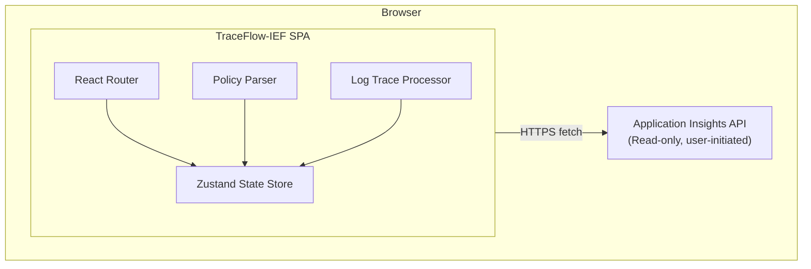
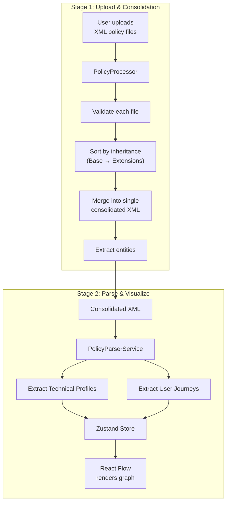
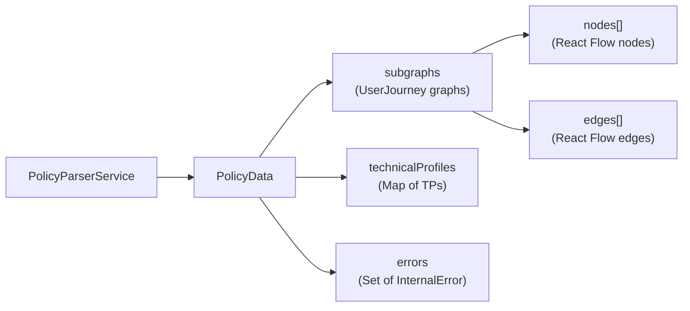
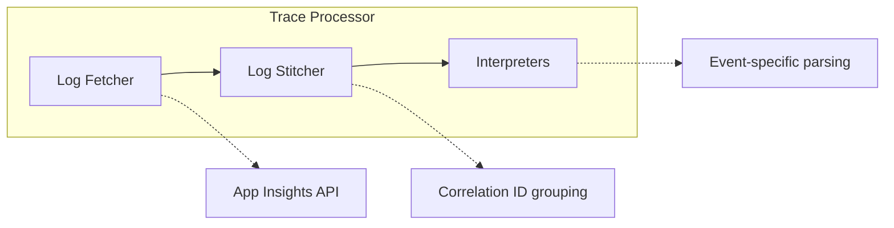
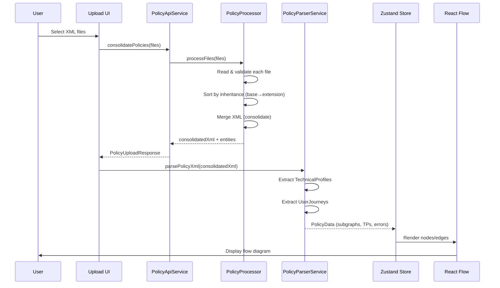
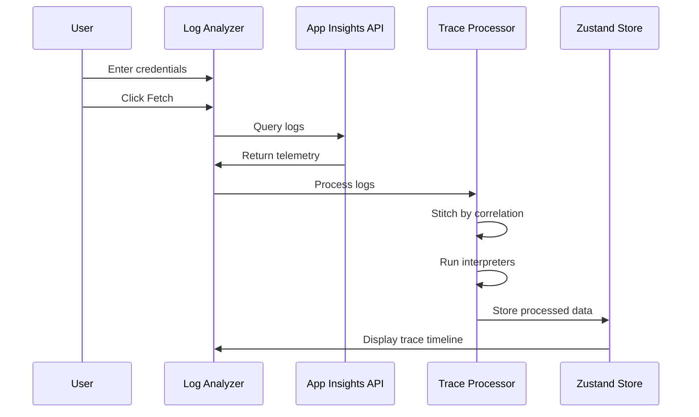

# TraceFlow-IEF Architecture

This document describes the technical architecture of TraceFlow-IEF.

## Overview

TraceFlow-IEF is a **Single Page Application (SPA)** built with React and TypeScript. It processes B2C custom policy XML files and analyzes Application Insights logs.



## Core Modules

### 1. Routing (`src/routes/`)

File-based routing powered by **TanStack Router**:

| Route | Component | Description |
|-------|-----------|-------------|
| `/` | `index.tsx` | Home page with feature overview |
| `/b2c/policy-template` | `policy-template.tsx` | Policy flow visualization |
| `/b2c/analyze-logs` | `analyze-logs.tsx` | Log analyzer interface |
| `/b2c/claims` | `claims.tsx` | Claims management |
| `/settings` | `settings.tsx` | Application settings |
| `/entra` | `entra.tsx` | Entra ID features |

The root layout (`__root.tsx`) wraps all routes with providers:
- `ThemeProvider` - Dark/light theme management
- `SidebarNavigationProvider` - Sidebar state and navigation history
- `TooltipProvider` - Global tooltip configuration

### 2. Policy Processing Architecture

TraceFlow-IEF has a two-stage policy processing pipeline:



#### Stage 1: PolicyProcessor (`src/lib/policyProcessor/`)

Handles file upload, validation, and XML inheritance merging.

**Key Components:**

| File | Responsibility |
|------|----------------|
| `policy-processor.ts` | Orchestrates the processing pipeline |
| `policy-validator.ts` | Validates policy structure (required elements, attributes) |
| `policy-consolidator.ts` | Merges multiple policies into single XML using inheritance rules |
| `extractors/entity-extractor.ts` | Extracts claim types, transformations, providers |

**Inheritance Resolution:**

B2C policies use XML inheritance (BasePolicy references). The processor:
1. Reads all uploaded files
2. Validates each file's structure
3. Builds inheritance graph (which policy extends which)
4. Topologically sorts policies (base policies first)
5. Merges XML elements from base to extension
6. Produces single consolidated policy XML

#### Stage 2: PolicyParserService (`src/lib/policyParser/`)

Parses the consolidated XML and builds the visualization graph.

**Key Components:**

| File | Responsibility |
|------|----------------|
| `policy-parser-service.ts` | Entry point - coordinates extraction |
| `xml-parser-service.ts` | Raw XML parsing using fast-xml-parser |
| `technical-profile-parser.ts` | Extracts and resolves Technical Profiles |
| `extractors/user-journey-extractor.ts` | Extracts User Journey steps |
| `extractors/orchestration-steps-extractor.ts` | Extracts orchestration step details |

**Output Data:**



### 3. Log Trace Processor (`src/lib/trace/`)

Processes Application Insights telemetry data to reconstruct user journeys.

**Architecture:**



**Interpreter Registry:**
- Extensible system for handling different log event types
- Each interpreter handles specific B2C events (orchestration steps, technical profiles, etc.)
- See [TRACE_INTERPRETERS.md](TRACE_INTERPRETERS.md) for details

### 4. State Management (`src/stores/`)

**Zustand** stores for application state:

| Store | Purpose |
|-------|---------|
| `useSidebarToggle` | Sidebar collapsed/expanded state |
| `usePolicyStore` | Parsed policy data and entities |
| `useLogStore` | Fetched logs and selected flows |
| `useReactFlowStore` | React Flow graph state |

**Pattern:**
```typescript
// Creating a store
import { create } from 'zustand';
import { persist } from 'zustand/middleware';

interface SidebarStore {
  isOpen: boolean;
  setIsOpen: () => void;
}

export const useSidebarToggle = create<SidebarStore>()(
  persist(
    (set) => ({
      isOpen: true,
      setIsOpen: () => set((state) => ({ isOpen: !state.isOpen })),
    }),
    { name: 'sidebar-toggle' }
  )
);
```

### 5. UI Components (`src/components/`)

Component architecture based on **Radix UI** primitives:

**Component Structure:**

| Directory | Purpose | Examples |
|-----------|---------|----------|
| `ui/` | Base UI primitives (Radix wrappers) | `button.tsx`, `card.tsx`, `dialog.tsx` |
| `layout/` | Layout components | `main-layout.tsx`, `sidebar.tsx`, `content-layout.tsx` |
| `menu/` | Navigation components | `menu.tsx`, `menuItem.tsx` |
| `nodeTypes/` | React Flow custom nodes | `group-node.tsx`, `claims-exchange-node.tsx` |
| `policy-logs/` | Log analyzer components | `index.tsx`, `settings-card.tsx`, `trace-timeline.tsx` |

### 6. Flow Visualization

Built on **@xyflow/react** (React Flow):

**Custom Node Types:**
| Node Type | Purpose |
|-----------|---------|
| `GroupNode` | User Journey containers |
| `ConditionedNode` | Steps with preconditions |
| `ClaimsExchangeNode` | Claims exchange steps |
| `CombinedSignInAndSignUpNode` | Combined sign-in/sign-up |
| `StartNode` / `EndNode` | Journey boundaries |
| `CommentNode` | User-added annotations |

**Layout Engine:**
- Uses `@dagrejs/dagre` for automatic graph layout
- Supports horizontal and vertical orientations

## Data Flow

### Policy Upload Flow



### Log Analysis Flow



## Performance Considerations

### Code Splitting

Vite automatically splits the bundle into chunks:
- `vendor-react` - React and ReactDOM
- `vendor-router` - TanStack Router
- `vendor-xyflow` - React Flow and Dagre
- `vendor-radix` - Radix UI components
- `vendor-utils` - Utility libraries

Heavy components like `TabbedPolicyFlow` are lazy-loaded:
```typescript
const TabbedPolicyFlow = lazy(() => import('@components/tabbed-policy-flow'));
```

### State Persistence

Zustand stores use the `persist` middleware to save state to localStorage:
- Sidebar toggle state
- Theme preference
- Recent Application Insights credentials (encrypted)

## Security Model

### Data Privacy

- **Local processing** - XML policy files are processed locally and not uploaded
- **User-controlled API calls** - App Insights queries are explicitly initiated by the user

### Application Insights Integration

- Credentials are stored locally
- API calls go directly to Azure Application Insights
- Read-only access (query only, no modifications)

## Testing Strategy

### Unit Tests (Vitest)

**Test Directory Structure:**

| Path | Purpose |
|------|---------|
| `src/lib/trace/__tests__/` | Trace processor tests |
| `src/test/components/` | Component tests |
| `src/test/hooks/` | Hook tests |
| `src/test/lib/` | Library tests |
| `src/test/lib/policyProcessor/` | Policy processor tests |

**Coverage Areas:**
- Policy parsing edge cases
- Log stitching algorithms
- Interpreter registry
- React Flow store operations

### Component Testing (React Testing Library)

```typescript
import { render, screen } from '@testing-library/react';
import { GroupNode } from '@/components/nodeTypes';

test('renders group node with label', () => {
  render(<GroupNode data={{ label: 'TestJourney' }} />);
  expect(screen.getByText('TestJourney')).toBeInTheDocument();
});
```

## Browser Support

| Browser | Minimum Version |
|---------|----------------|
| Chrome | 90+ |
| Firefox | 90+ |
| Safari | 15+ |
| Edge | 90+ |

The application uses modern JavaScript features:
- ES2022 syntax
- Native `fetch` API
- CSS Custom Properties
- ResizeObserver
- IntersectionObserver
