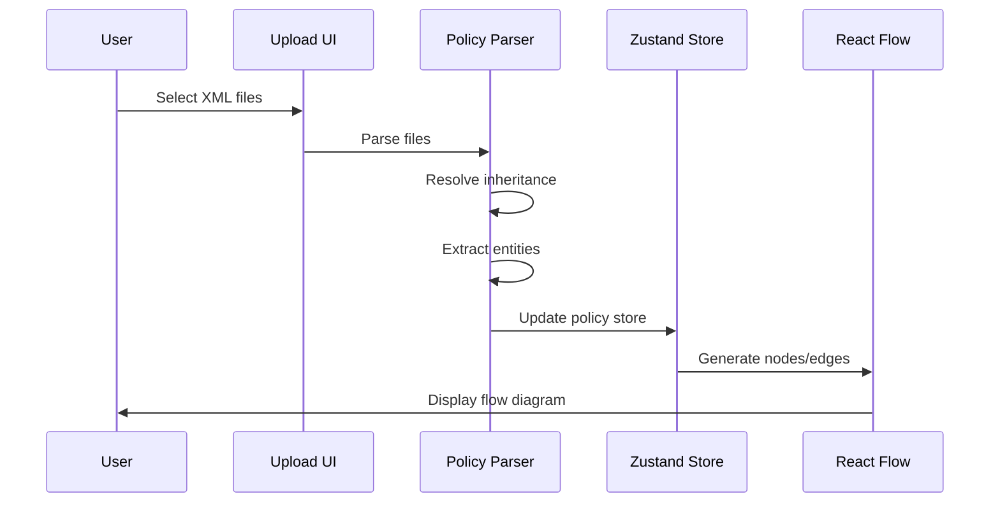
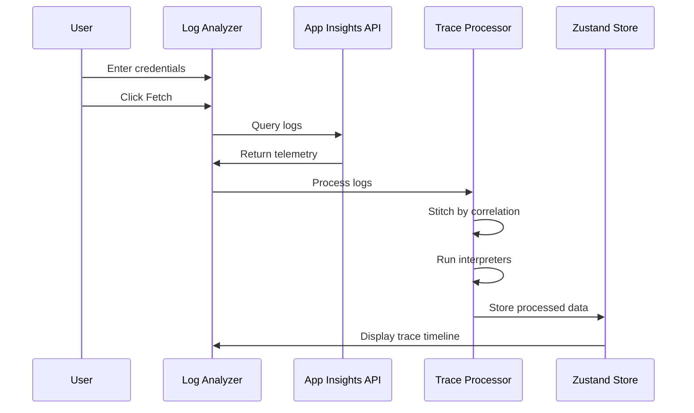

# TraceFlow-IEF Architecture

This document describes the technical architecture of TraceFlow-IEF.

## Overview

TraceFlow-IEF is a **pure client-side Single Page Application (SPA)** built with React and TypeScript. All data processing, including XML policy parsing and log trace analysis, happens entirely in the browser.

```
┌─────────────────────────────────────────────────────────────────┐
│                           Browser                               │
│  ┌───────────────────────────────────────────────────────────┐ │
│  │                    TraceFlow-IEF SPA                       │ │
│  │  ┌─────────────┐  ┌──────────────┐  ┌──────────────────┐  │ │
│  │  │   React     │  │   Policy     │  │   Log Trace      │  │ │
│  │  │   Router    │  │   Parser     │  │   Processor      │  │ │
│  │  └──────┬──────┘  └──────┬───────┘  └────────┬─────────┘  │ │
│  │         │                │                    │            │ │
│  │  ┌──────▼──────────────────────────────────▼─────────────┐ │ │
│  │  │                  Zustand State Store                    │ │ │
│  │  └─────────────────────────────────────────────────────────┘ │ │
│  └───────────────────────────────────────────────────────────┘ │
│                              │                                   │
│                              │ HTTPS (fetch)                     │
│                              ▼                                   │
│              ┌──────────────────────────────┐                    │
│              │    Application Insights API   │                   │
│              │    (Read-only, user-initiated)│                   │
│              └──────────────────────────────┘                    │
└─────────────────────────────────────────────────────────────────┘
```

## Core Modules

### 1. Routing (`src/routes/`)

File-based routing powered by **TanStack Router**:

| Route | Component | Description |
|-------|-----------|-------------|
| `/` | `index.tsx` | Home page with feature overview |
| `/b2c/policy-template` | `policy-template.tsx` | Policy flow visualization |
| `/b2c/analyze-logs` | `analyze-logs.tsx` | Log analyzer interface |
| `/b2c/claims` | `claims.tsx` | Claims management |
| `/settings` | `settings.tsx` | Application settings |
| `/entra` | `entra.tsx` | Entra ID features |

The root layout (`__root.tsx`) wraps all routes with providers:
- `ThemeProvider` - Dark/light theme management
- `SidebarNavigationProvider` - Sidebar state and navigation history
- `TooltipProvider` - Global tooltip configuration

### 2. Policy Parser (`src/lib/policyParser/`)

Client-side XML parsing engine for B2C custom policies.

**Key Responsibilities:**
- Parse policy XML files using `fast-xml-parser`
- Resolve policy inheritance chains
- Extract entities (Claims, Technical Profiles, User Journeys)
- Build flow graph for visualization

**Data Flow:**
```
XML Files → Parser → PolicyService → Zustand Store → React Flow
     │                      │
     │                      ├── ClaimTypes
     │                      ├── TechnicalProfiles
     │                      ├── UserJourneys
     │                      ├── SubJourneys
     │                      └── ClaimsTransformations
     │
     └── (No network requests - all client-side)
```

### 3. Log Trace Processor (`src/lib/trace/`)

Processes Application Insights telemetry data to reconstruct user journeys.

**Architecture:**
```
┌────────────────────────────────────────────────────────┐
│                  Trace Processor                        │
│  ┌──────────────┐  ┌──────────────┐  ┌──────────────┐  │
│  │  Log Fetcher │→│ Log Stitcher  │→│ Interpreters │  │
│  └──────────────┘  └──────────────┘  └──────────────┘  │
│         │                 │                  │          │
│         ▼                 ▼                  ▼          │
│   App Insights      Correlation ID     Event-specific   │
│       API           grouping           parsing          │
└────────────────────────────────────────────────────────┘
```

**Interpreter Registry:**
- Extensible system for handling different log event types
- Each interpreter handles specific B2C events (orchestration steps, technical profiles, etc.)
- See [TRACE_INTERPRETERS.md](TRACE_INTERPRETERS.md) for details

### 4. State Management (`src/stores/`)

**Zustand** stores for application state:

| Store | Purpose |
|-------|---------|
| `useSidebarToggle` | Sidebar collapsed/expanded state |
| `usePolicyStore` | Parsed policy data and entities |
| `useLogStore` | Fetched logs and selected flows |
| `useReactFlowStore` | React Flow graph state |

**Pattern:**
```typescript
// Creating a store
import { create } from 'zustand';
import { persist } from 'zustand/middleware';

interface SidebarStore {
  isOpen: boolean;
  setIsOpen: () => void;
}

export const useSidebarToggle = create<SidebarStore>()(
  persist(
    (set) => ({
      isOpen: true,
      setIsOpen: () => set((state) => ({ isOpen: !state.isOpen })),
    }),
    { name: 'sidebar-toggle' }
  )
);
```

### 5. UI Components (`src/components/`)

Component architecture based on **Radix UI** primitives:

```
src/components/
├── ui/                    # Base UI primitives (Radix wrappers)
│   ├── button.tsx
│   ├── card.tsx
│   ├── dialog.tsx
│   └── ...
├── layout/               # Layout components
│   ├── main-layout.tsx
│   ├── sidebar.tsx
│   └── content-layout.tsx
├── menu/                 # Navigation components
│   ├── menu.tsx
│   └── menuItem.tsx
├── nodeTypes/            # React Flow custom nodes
│   ├── group-node.tsx
│   ├── claims-exchange-node.tsx
│   └── ...
└── policy-logs/          # Log analyzer components
    ├── index.tsx
    ├── settings-card.tsx
    └── trace-timeline.tsx
```

### 6. Flow Visualization

Built on **@xyflow/react** (React Flow):

**Custom Node Types:**
| Node Type | Purpose |
|-----------|---------|
| `GroupNode` | User Journey containers |
| `ConditionedNode` | Steps with preconditions |
| `ClaimsExchangeNode` | Claims exchange steps |
| `CombinedSignInAndSignUpNode` | Combined sign-in/sign-up |
| `StartNode` / `EndNode` | Journey boundaries |
| `CommentNode` | User-added annotations |

**Layout Engine:**
- Uses `@dagrejs/dagre` for automatic graph layout
- Supports horizontal and vertical orientations

## Data Flow

### Policy Upload Flow



### Log Analysis Flow



## Performance Considerations

### Code Splitting

Vite automatically splits the bundle into chunks:
- `vendor-react` - React and ReactDOM
- `vendor-router` - TanStack Router
- `vendor-xyflow` - React Flow and Dagre
- `vendor-radix` - Radix UI components
- `vendor-utils` - Utility libraries

Heavy components like `TabbedPolicyFlow` are lazy-loaded:
```typescript
const TabbedPolicyFlow = lazy(() => import('@components/tabbed-policy-flow'));
```

### State Persistence

Zustand stores use the `persist` middleware to save state to localStorage:
- Sidebar toggle state
- Theme preference
- Recent Application Insights credentials (encrypted)

## Security Model

### Client-Side Processing

- **No server-side processing** - All XML parsing happens in the browser
- **No data exfiltration** - Policy files never leave the user's machine
- **User-controlled API calls** - App Insights queries are explicitly initiated

### Application Insights Integration

- Credentials are stored locally and never sent to any third-party
- API calls go directly from browser to Azure Application Insights
- Read-only access (query only, no modifications)

## Testing Strategy

### Unit Tests (Vitest)

```
src/
├── lib/
│   └── trace/
│       └── __tests__/     # Trace processor tests
├── test/
│   ├── components/        # Component tests
│   ├── hooks/             # Hook tests
│   └── lib/               # Library tests
```

**Coverage Areas:**
- Policy parsing edge cases
- Log stitching algorithms
- Interpreter registry
- React Flow store operations

### Component Testing (React Testing Library)

```typescript
import { render, screen } from '@testing-library/react';
import { GroupNode } from '@/components/nodeTypes';

test('renders group node with label', () => {
  render(<GroupNode data={{ label: 'TestJourney' }} />);
  expect(screen.getByText('TestJourney')).toBeInTheDocument();
});
```

### Visual Testing (Storybook)

Components are developed in isolation with Storybook stories:
```typescript
// button.stories.tsx
export const Primary: Story = {
  args: { variant: 'default', children: 'Button' }
};

export const Destructive: Story = {
  args: { variant: 'destructive', children: 'Delete' }
};
```

## Browser Support

| Browser | Minimum Version |
|---------|----------------|
| Chrome | 90+ |
| Firefox | 90+ |
| Safari | 15+ |
| Edge | 90+ |

The application uses modern JavaScript features:
- ES2022 syntax
- Native `fetch` API
- CSS Custom Properties
- ResizeObserver
- IntersectionObserver
