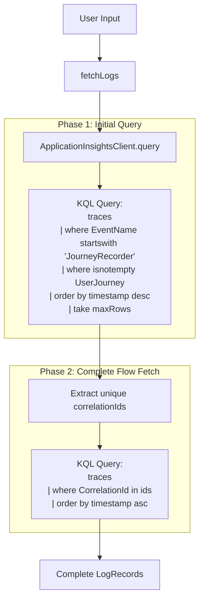
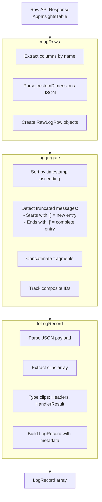
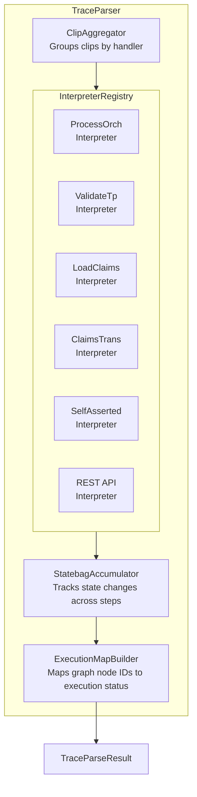

# B2C Log Analyzer Architecture

This document provides comprehensive documentation for the B2C Policy Log Analyzer feature, which allows developers to query, visualize, and debug Azure AD B2C Journey Recorder logs from Application Insights.

## Table of Contents

1. [Overview](#overview)
2. [Architecture](#architecture)
3. [Data Flow](#data-flow)
4. [Key Components](#key-components)
5. [Log Processing Pipeline](#log-processing-pipeline)
6. [Trace Parsing System](#trace-parsing-system)
7. [UI Components](#ui-components)
8. [Type System](#type-system)
9. [Troubleshooting](#troubleshooting)

---

## Overview

The Log Analyzer feature enables debugging of Azure AD B2C Custom Policies by:

- Querying Journey Recorder logs from Application Insights
- Merging truncated log messages that were split across multiple rows
- Parsing B2C-specific "clips" (structured event data)
- Grouping logs into distinct user flows
- Generating step-by-step trace visualizations
- Displaying statebag and claims data at each step

### Key Concepts

| Term | Description |
|------|-------------|
| **Journey Recorder** | B2C's built-in diagnostic logging system that emits structured events |
| **Clips** | JSON-structured events within a log message (Headers, Transition, HandlerResult, etc.) |
| **Statebag** | B2C's internal state dictionary tracking policy execution context |
| **Correlation ID** | Unique identifier linking all logs from a single policy execution |
| **User Flow** | A complete policy execution from start to finish |
| **Orchestration Step** | A numbered step in the policy's user journey |

---

## Architecture

```mermaid
flowchart TB
    subgraph UI["UI LAYER"]
        direction LR
        CF[credentials-form<br/>App ID, API Key<br/>Timespan, Search]
        RT[results-table<br/>Log listing with<br/>flow grouping]
        TT[trace-timeline<br/>Step-by-step visualization<br/>with statebag inspection]
        DV[detail-viewer<br/>Raw JSON & structured clip view]
    end

    subgraph STATE["STATE LAYER (Zustand)"]
        LS[log-store.ts<br/>• credentials<br/>• preferences<br/>• logs: LogRecord[]<br/>• userFlows: UserFlow[]<br/>• traceSteps: TraceStep[]<br/>• executionMap<br/>• selectedLog, selectedFlow]
    end

    subgraph PROCESSING["PROCESSING LAYER"]
        AIP[app-insights-processor.ts<br/>1. mapRows<br/>2. aggregate<br/>3. toLogRecord]
        subgraph TRACE["trace/ module"]
            TP[TraceParser]
            INT[Interpreters]
            FA[FlowAnalyzer]
            SA[StatebagAccumulator]
        end
    end

    subgraph API["API LAYER"]
        AIC[application-insights-client.ts<br/>• query<br/>• fetchCompleteFlows<br/>• KQL query generation]
    end

    AZURE[(Azure Application Insights<br/>REST API)]

    UI --> STATE
    STATE --> PROCESSING
    AIP --> TRACE
    PROCESSING --> API
    API --> AZURE
```

---

## Data Flow

### 1. Query Execution



**Why Two Phases?**
- Initial query may return partial flows (e.g., only the last 50 logs of a 100-log flow)
- Phase 2 ensures we have ALL logs for each flow, enabling complete trace reconstruction

### 2. Log Processing Pipeline



### 3. Message Aggregation (Truncation Handling)

Application Insights truncates messages at ~32KB. B2C Journey Recorder logs often exceed this, resulting in split messages:

```
Log Entry 1 (timestamp: T1):
  message: '[{"Kind":"Headers","Content":{"PolicyId":"B2C_1A_..."...<truncated>

Log Entry 2 (timestamp: T2, microseconds after T1):
  message: ...}},{"Kind":"HandlerResult","Content":{...}}]'
```

**Aggregation Algorithm:**

```mermaid
flowchart TD
    START[For each row] --> CHECK1{Starts with '[' ?}
    CHECK1 -->|Yes| NEW[Start new accumulator<br/>Save row as entryStartRow]
    CHECK1 -->|No| CHECK2{entryStartRow exists?}
    CHECK2 -->|Yes| APPEND[Append to accumulator]
    CHECK2 -->|No| PLAIN[Plain text message<br/>Create entry immediately]
    
    NEW --> CHECK3{Ends with ']' ?}
    APPEND --> CHECK3
    CHECK3 -->|Yes| CREATE[Create AggregatedLogRow<br/>with merged message<br/>Reset accumulator]
    CHECK3 -->|No| NEXT[Continue to next row]
    
    CREATE --> NEXT
    PLAIN --> NEXT
    NEXT --> START
```

---

## Key Components

### ApplicationInsightsClient

**Location:** `src/lib/api/application-insights-client.ts`

**Responsibilities:**
- Build KQL queries for B2C Journey Recorder events
- Execute queries against Application Insights REST API
- Handle two-phase query for complete flows

**Key Methods:**

| Method | Purpose |
|--------|---------|
| `query()` | Initial search query with filters |
| `fetchCompleteFlows()` | Fetch all logs for given correlation IDs |
| `extractPrimaryTable()` | Extract result table from API response |

### AppInsightsProcessor

**Location:** `src/lib/app-insights-processor.ts`

**Responsibilities:**
- Convert raw API response to typed LogRecord objects
- Merge truncated log messages
- Parse clip arrays with proper typing

**Processing Steps:**

1. **mapRows()** - Map raw row arrays to structured objects
2. **aggregate()** - Merge truncated messages by detecting `[` and `]` boundaries
3. **toLogRecord()** - Parse JSON, extract and type clips

### LogStore (Zustand)

**Location:** `src/stores/log-store.ts`

**State Structure:**

```typescript
interface LogStore {
  // Credentials & Preferences
  credentials: { applicationId: string; apiKey: string };
  preferences: { maxRows: number; timespan: string };
  
  // Log Data
  logs: LogRecord[];
  selectedLog: LogRecord | null;
  userFlows: UserFlow[];
  selectedFlow: UserFlow | null;
  
  // Trace Data
  traceSteps: TraceStep[];
  executionMap: TraceExecutionMap;
  activeStepIndex: number | null;
  
  // UI State
  isLoading: boolean;
  error: string | null;
  searchText: string;
}
```

**Key Actions:**

| Action | Purpose |
|--------|---------|
| `fetchLogs()` | Execute query and process results |
| `setSelectedLog()` | Select log and auto-generate trace |
| `selectFlow()` | Switch to different user flow |
| `generateTrace()` | Manually regenerate trace from logs |
| `setActiveStep()` | Navigate trace timeline |

---

## Trace Parsing System

The trace module (`src/lib/trace/`) parses clips into a step-by-step execution trace.

### Architecture



### Interpreter Pattern

Each B2C handler type has a specialized interpreter:

| Handler | Interpreter | Purpose |
|---------|-------------|---------|
| `ProcessOrchestrationStep` | `ProcessOrchStepInterpreter` | New orchestration step |
| `ValidateTechnicalProfile` | `ValidateTechnicalProfileInterpreter` | TP execution |
| `LoadClaimsViaTp` | `LoadClaimsInterpreter` | Claims provider calls |
| `ClaimsTransformation` | `ClaimsTransformationInterpreter` | CT execution |
| `SelfAssertedPage` | `SelfAssertedInterpreter` | User input pages |
| `RestAPIProvider` | `RestApiInterpreter` | External API calls |

**Interpreter Interface:**

```typescript
interface Interpreter {
  readonly handlerName: string;
  interpret(context: InterpretContext): InterpretResult;
}

interface InterpretResult {
  success: boolean;
  createStep?: boolean;           // Should create new trace step
  actionHandler?: string;         // Handler name for display
  technicalProfiles?: string[];   // TPs executed
  statebagUpdates?: Record<string, string>;
  claimsUpdates?: Record<string, string>;
  stepResult?: "Success" | "Error" | "Skipped";
  // ... many more fields
}
```

### Flow Analyzer

**Location:** `src/lib/trace/services/flow-analyzer.ts`

Groups logs into distinct user flows. A new flow starts when:

1. A new `correlationId` is encountered
2. `ORCH_CS = 0` is detected (flow initialization)
3. Step number goes backwards (user navigated back)

**Exception:** SubJourney invocation can reset `ORCH_CS` to 0 without starting a new flow.

---

## UI Components

### credentials-form.tsx

Form for entering Application Insights credentials:
- Application ID (GUID)
- API Key
- Timespan (ISO 8601 duration)
- Max rows
- Search text (optional)

### results-table.tsx

Displays query results:
- Flow selector (grouped by correlationId)
- Log list with timestamps and policy IDs
- Status indicators (completed, errors, cancelled)

### trace-timeline.tsx

Step-by-step trace visualization:
- Sequential step cards
- Active step highlighting
- Navigation controls (prev/next)
- Statebag inspector integration

### statebag-inspector.tsx

Displays statebag and claims at selected step:
- Key-value pairs
- Diff highlighting (what changed)
- Search/filter capability

### detail-viewer.tsx

Raw log inspection:
- Formatted JSON view
- Clip breakdown
- Copy functionality

---

## Type System

### Core Types

**Location:** `src/types/logs.ts`

```typescript
interface LogRecord {
  id: string;
  timestamp: Date;
  policyId: string;
  correlationId: string;
  cloudRoleInstance?: string;
  rawIds: string[];              // IDs of merged log entries
  payloadText: string;           // Raw message text
  parsedPayload: unknown;        // Parsed JSON
  clips: ClipsArray;             // Typed clip array
  customDimensions: CustomDimensions;
}
```

### Clip Types

**Location:** `src/types/journey-recorder.ts`

```typescript
type Clip =
  | HeadersClip
  | TransitionClip
  | PredicateClip
  | ActionClip
  | HandlerResultClip
  | FatalExceptionClip
  | GenericClip;

interface HeadersClip {
  Kind: "Headers";
  Content: {
    UserJourneyRecorderEndpoint: string;
    CorrelationId: string;
    EventInstance: string;  // "Event:AUTH", "Event:SELFASSERTED", etc.
    TenantId: string;
    PolicyId: string;
  };
}

interface HandlerResultClip {
  Kind: "HandlerResult";
  Content: {
    Result: boolean;
    PredicateResult?: string;
    RecorderRecord?: RecorderRecord;
    Statebag?: Statebag;
    Exception?: ExceptionContent;
  };
}
```

### Trace Types

**Location:** `src/types/trace.ts`

```typescript
interface TraceStep {
  sequenceNumber: number;
  timestamp: Date;
  stepOrder: number;            // Orchestration step number
  journeyContextId: string;     // Policy ID
  actionHandler: string;        // Handler that executed
  technicalProfiles: string[];  // TPs involved
  result: "Success" | "Error" | "Skipped" | "Pending";
  errorMessage?: string;
  statebagSnapshot: Record<string, string>;
  claimsSnapshot: Record<string, string>;
  duration?: number;            // ms to next step
  // ... many more fields
}

interface UserFlow {
  id: string;
  correlationId: string;
  policyId: string;
  startTime: Date;
  endTime: Date;
  stepCount: number;
  completed: boolean;
  hasErrors: boolean;
  cancelled: boolean;
  subJourneys: string[];
  logIds: string[];
}
```

---

## Troubleshooting

### Common Issues

#### Logs Not Appearing

1. **Check credentials:** Ensure Application ID and API Key are correct
2. **Check timespan:** Logs may be outside the query window
3. **Check filters:** Search text or policy filters may be too restrictive

#### Truncated Logs Not Merging

The `aggregate()` function merges logs by detecting `[` (start) and `]` (end) boundaries. If logs aren't merging:

1. **Check timestamp sorting:** Logs must be sorted chronologically
2. **Check message format:** Messages must be valid JSON arrays starting with `[`
3. **Enable debug logging:** Temporarily add console.logs in `aggregate()`

#### Trace Steps Missing

1. **Check event types:** Only `Event:AUTH`, `Event:API`, `Event:SELFASSERTED`, and `Event:ClaimsExchange` are processed
2. **Check clip structure:** HandlerResult clips must have proper Statebag entries
3. **Check interpreter:** The handler may not have a registered interpreter

#### Performance Issues

1. **Reduce maxRows:** Large result sets slow down processing
2. **Use search filters:** Narrow down to specific policies or users
3. **Check browser memory:** Very large traces may exhaust memory

### Debug Tools

**Browser DevTools:**
- Network tab: Verify API requests/responses
- Console: Check for processing errors
- React DevTools: Inspect store state

**Log Store Debugging:**
```typescript
// In browser console:
const store = window.__ZUSTAND_LOG_STORE__;
console.log(store.getState());
```

---

## See Also

- [Application Insights REST API](https://learn.microsoft.com/en-us/rest/api/application-insights/)
- [B2C Custom Policy Schema](https://learn.microsoft.com/en-us/azure/active-directory-b2c/trustframeworkpolicy)
- [Journey Recorder Documentation](https://learn.microsoft.com/en-us/azure/active-directory-b2c/troubleshoot-with-application-insights)
